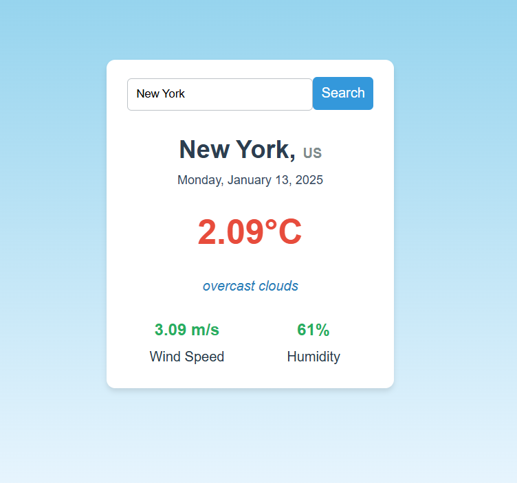
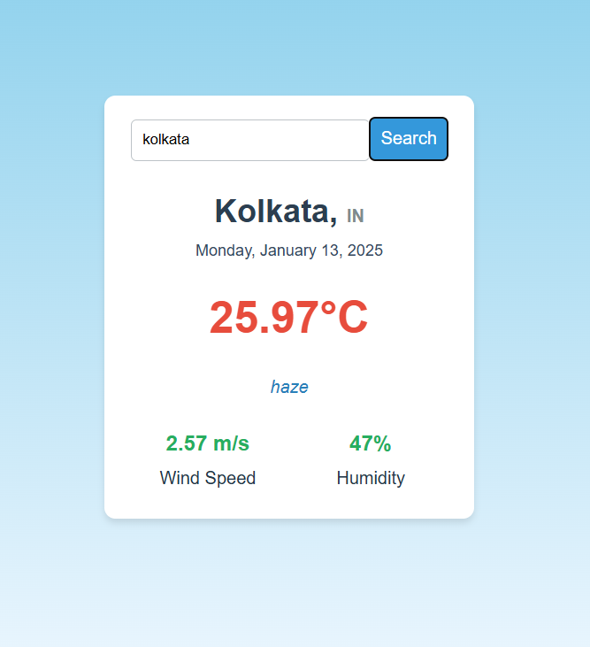
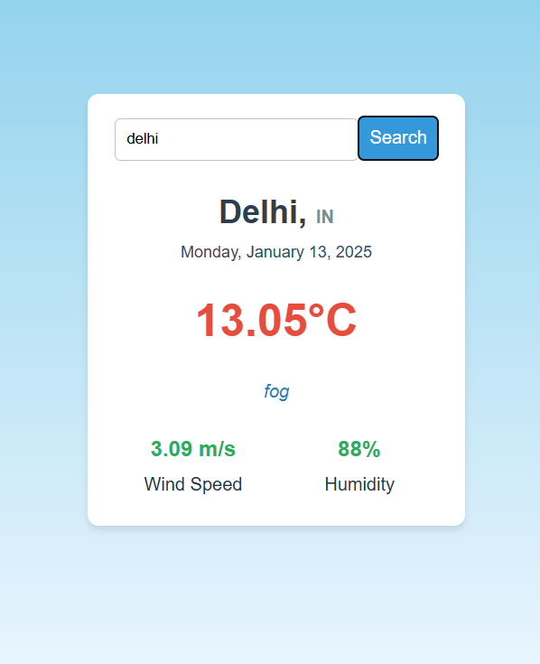

# React + Vite

This template provides a minimal setup to get React working in Vite with HMR and some ESLint rules.

Currently, two official plugins are available:

- [@vitejs/plugin-react](https://github.com/vitejs/vite-plugin-react/blob/main/packages/plugin-react/README.md) uses [Babel](https://babeljs.io/) for Fast Refresh
- [@vitejs/plugin-react-swc](https://github.com/vitejs/vite-plugin-react-swc) uses [SWC](https://swc.rs/) for Fast Refresh
# Weather APP

## Core Features:
Display weather details such as temperature, humidity, wind speed, and description.
Provide a search functionality for users to look up weather in different cities.
Show a default city’s weather on page load (e.g., Bangalore).
Center the application visually for a clean UI.
API Integration: Use the OpenWeatherMap API to fetch weather data.
## Plan the Application Structure
### Components:
Weather Component: Main component responsible for fetching and displaying weather data.
Search Component: Handles the input field and search button.
State Management:
Use React's useState to manage:
search: For storing the city entered by the user.
weatherData: For holding the API response.
loading: To indicate loading status during API calls.
## Implement Functional Logic
API Call Logic:
Use the fetch API to interact with OpenWeatherMap.
Handle edge cases like invalid city names or network errors.
Parse and store data in the component’s state.
Reusable Functions:
fetchWeatherData: Handles all API calls.
handleSearch: Triggers API calls based on user input.
getCurrentDate: Formats the current date.
##  Style the UI
Flexbox Centering: Ensure the application is centered vertically and horizontally for a professional look.
Styling Inputs and Buttons: Add user-friendly padding, borders, and hover effects.
Typography and Colors:
Use contrasting colors for readability.
Apply subtle shadows for depth.

## Snap shot of Project

